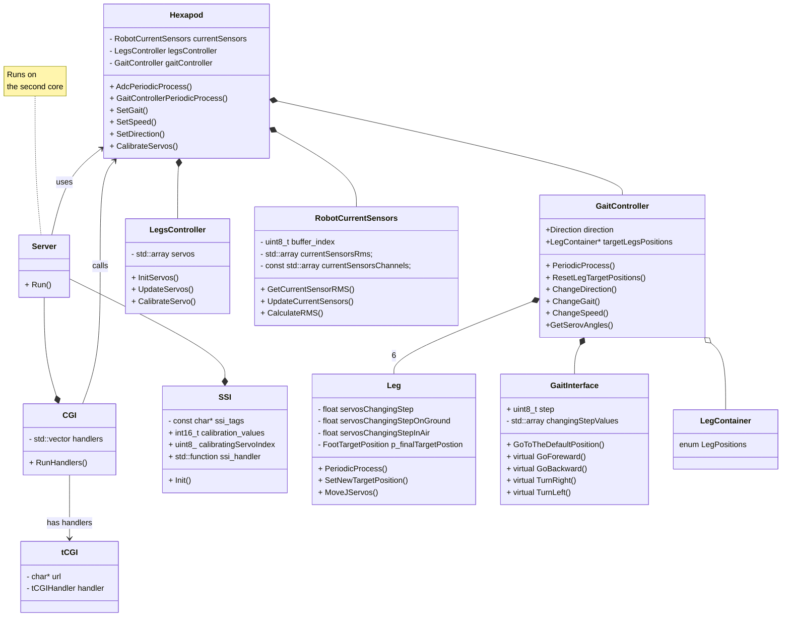
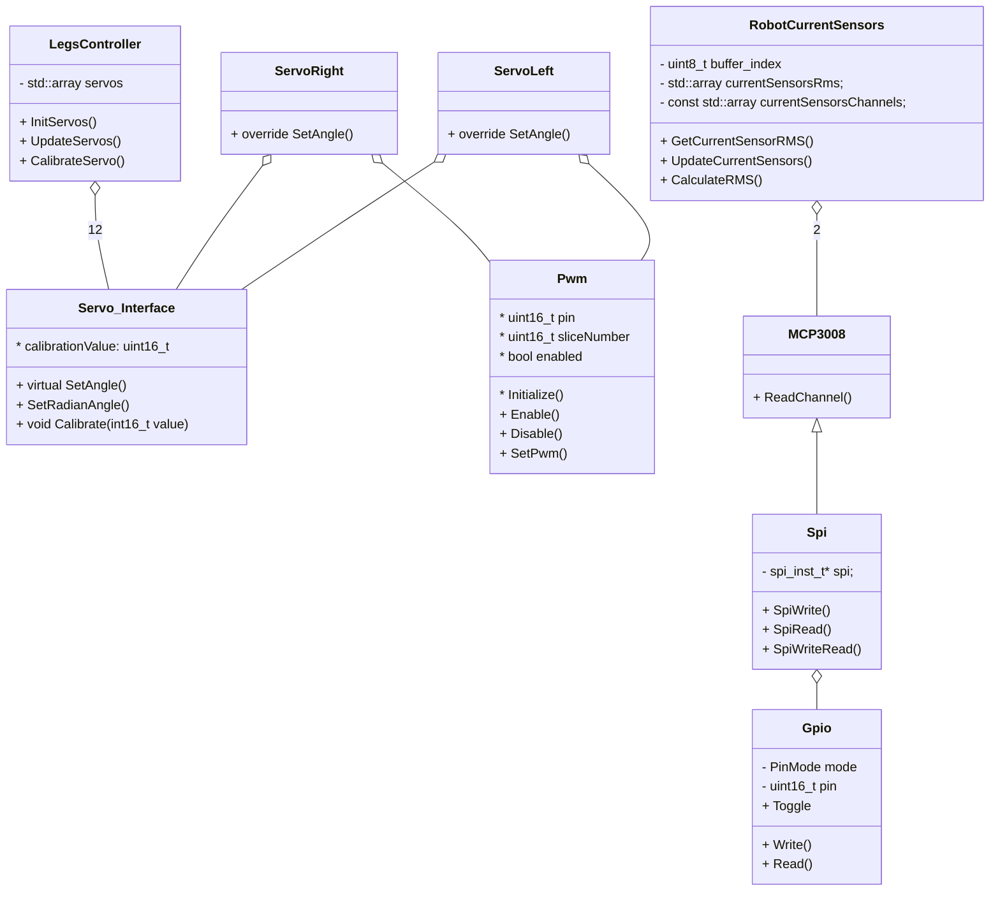
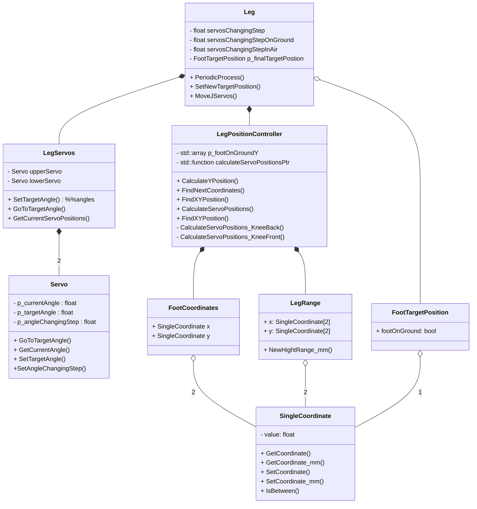
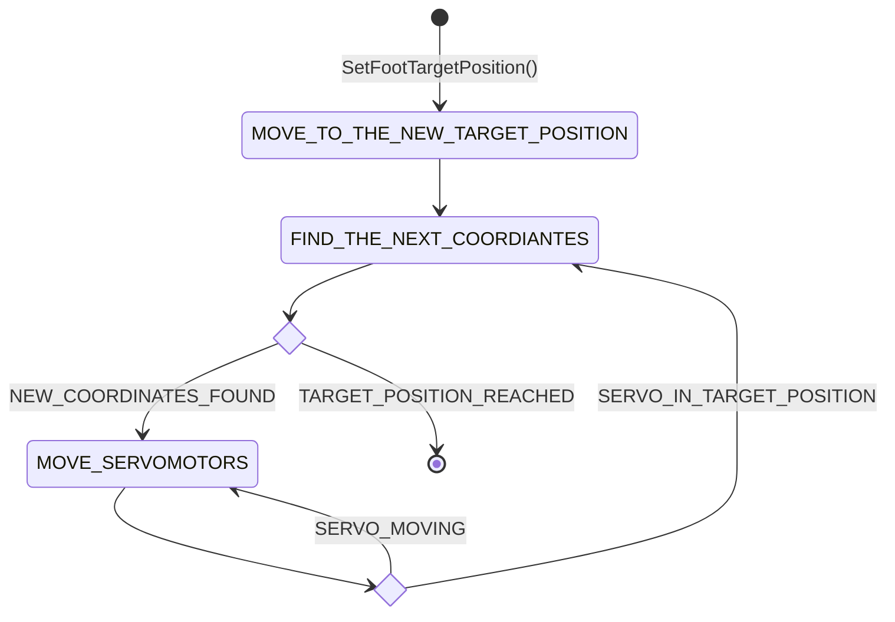
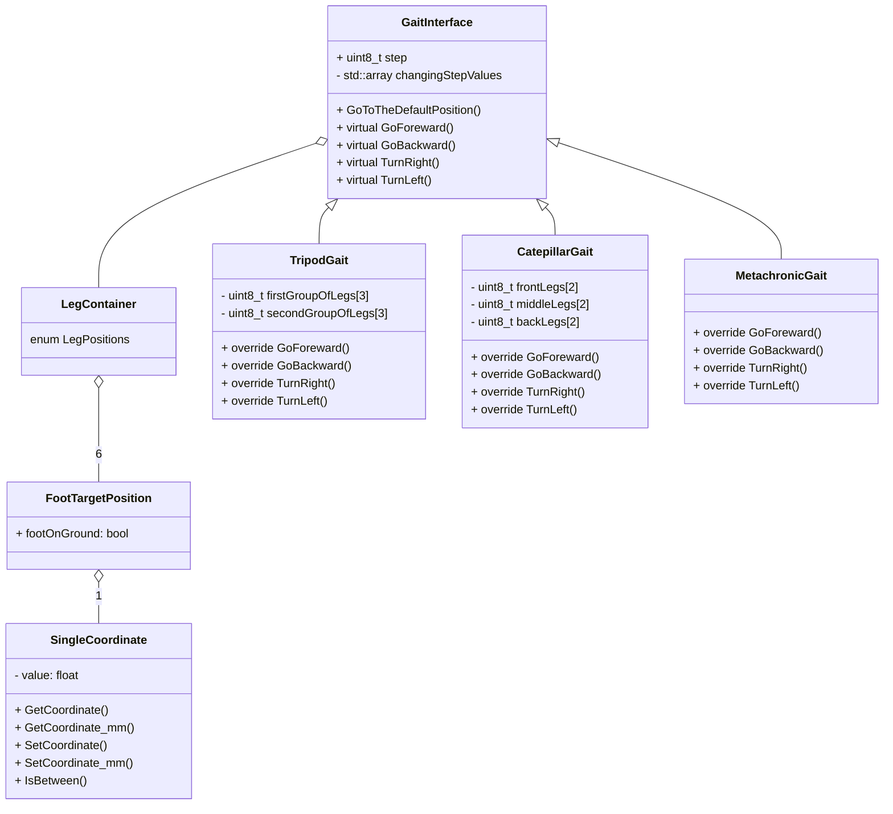

# Hexapod

## Class diagram of the project

### Project structure - main loop:

```mermaid
    classDiagram

    class Hexapod{
        - RobotCurrentSensors currentSensors
        - LegsController legsController
        - GaitController gaitController

        + AdcPeriodicProcess()
        + GaitControllerPeriodicProcess()
        + SetGait()
        + SetSpeed()
        + SetDirection()
        + CalibrateServos()
    }

    class Server{
        + Run()

    }

    class CGI {
        - std::vector<tCGI> handlers
        + RunHandlers()
    }

    class SSI {
        - const char* ssi_tags
        + int16_t calibration_values
        + uint8_ calibratingServoIndex
        + std::function ssi_handler
        + Init()
    }

    class tCGI {
        - char* url
        - tCGIHandler handler
    }

    class Leg{
        - float servosChangingStep
        - float servosChangingStepOnGround
        - float servosChangingStepInAir
        - FootTargetPosition p_finalTargetPostion

        + PeriodicProcess()
        + SetNewTargetPosition()
        + MoveJServos()
    }

    class GaitInterface{
        + uint8_t step
        - std::array<float, 2> changingStepValues

        + GoToTheDefaultPosition()
        + virtual GoForeward()
        + virtual GoBackward()
        + virtual TurnRight()
        + virtual TurnLeft()
    }

    class GaitController{
        +Direction direction
        +LegContainer* targetLegsPositions

        + PeriodicProcess()
        + ResetLegTargetPositions()

        + ChangeDirection()
        + ChangeGait()
        + ChangeSpeed()

        +GetSerovAngles()
    }

    class LegContainer{
        enum LegPositions
    }

    class LegsController {
        - std::array servos

        + InitServos()
        + UpdateServos()
        + CalibrateServo()
    }

    class RobotCurrentSensors {
        - uint8_t buffer_index
        - std::array<float, 12> currentSensorsRms;
        - const std::array<uint8_t, 12> currentSensorsChannels;

        + GetCurrentSensorRMS()
        + UpdateCurrentSensors()
        + CalculateRMS()

    }


    Server --* CGI
    Server --* SSI
    CGI --> Hexapod : calls
    CGI --> tCGI : has handlers

    Hexapod <-- Server : uses
    Hexapod *-- GaitController
    GaitController *-- GaitInterface
    GaitController *-- Leg:6
    GaitController o-- LegContainer

    Hexapod *-- LegsController
    Hexapod *-- RobotCurrentSensors

    note for Server "Runs on
    the second core"

```

### Hardware drivers:

```mermaid
classDiagram
    %%Driver classes relations:

    ServoLeft o-- Servo_Interface
    ServoLeft o-- Pwm
    ServoRight o-- Servo_Interface
    ServoRight o-- Pwm


    LegsController o-- Servo_Interface:12

    Spi o-- Gpio
    MCP3008 <|-- Spi
    RobotCurrentSensors o-- MCP3008:2


    class Gpio{
        - PinMode mode
        - uint16_t pin

        + Write()
        + Toggle
        + Read()
    }

    class Pwm{
        * uint16_t pin
        * uint16_t sliceNumber
        * bool enabled

        * Initialize()
        + Enable()
        + Disable()
        + SetPwm()
    }

    class Servo_Interface{
        * calibrationValue: uint16_t

        + virtual SetAngle()
        + SetRadianAngle()
        + void Calibrate(int16_t value)
    }
    class ServoLeft{
        + override SetAngle()
    }
    class ServoRight{
        + override SetAngle()
    }

    class LegsController {
        - std::array servos

        + InitServos()
        + UpdateServos()
        + CalibrateServo()
    }

    class Spi{
        - spi_inst_t* spi;
        + SpiWrite()
        + SpiRead()
        + SpiWriteRead()

    }

    class MCP3008 {
        + ReadChannel()
    }

    class RobotCurrentSensors {
        - uint8_t buffer_index
        - std::array<float, 12> currentSensorsRms;
        - const std::array<uint8_t, 12> currentSensorsChannels;

        + GetCurrentSensorRMS()
        + UpdateCurrentSensors()
        + CalculateRMS()

    }
```

### Robot Logic:

#### Leg Control:

```mermaid
classDiagram
    %%Logic classes relations:
    LegServos *-- Servo:2
    FootCoordinates o-- SingleCoordinate:2
    FootTargetPosition o-- SingleCoordinate:1
    LegRange o-- SingleCoordinate:2

    LegPositionController *-- FootCoordinates
    LegPositionController *-- LegRange

    Leg *-- LegServos
    Leg *-- LegPositionController
    Leg o-- FootTargetPosition


    %%Logic classes:
    class Servo{
        - p_currentAngle : float
        - p_targetAngle : float
        - p_angleChangingStep : float

        + GoToTargetAngle()
        + GetCurrentAngle()
        + SetTargetAngle()
        +SetAngleChangingStep()
    }

    class LegServos{
        - Servo upperServo
        - Servo lowerServo

        + SetTargetAngle()%%angles
        + GoToTargetAngle()
        + GetCurrentServoPositions()
    }

    class LegPositionController{
        - std::array<SingleCoordinate, 2> p_footOnGroundY
        - std::function calculateServoPositionsPtr

        + CalculateYPosition()
        + FindNextCoordinates()
        + FindXYPosition()
        + CalculateServoPositions()
        + FindXYPosition()

        - CalculateServoPositions_KneeBack()
        - CalculateServoPositions_KneeFront()
    }

    class SingleCoordinate{
        - value: float
        + GetCoordinate()
        + GetCoordinate_mm()
        + SetCoordinate()
        + SetCoordinate_mm()
        + IsBetween()
    }
    class FootCoordinates{
        + SingleCoordinate x
        + SingleCoordinate y
    }
    class FootTargetPosition{
        + footOnGround: bool
    }


    class LegRange{
        + x: SingleCoordinate[2]
        + y: SingleCoordinate[2]

        + NewHightRange_mm()
    }

    class Leg{
        - float servosChangingStep
        - float servosChangingStepOnGround
        - float servosChangingStepInAir
        - FootTargetPosition p_finalTargetPostion

        + PeriodicProcess()
        + SetNewTargetPosition()
        + MoveJServos()
    }
```

#### Robot Leg State Machine:

```mermaid
stateDiagram-v2

    [*] --> MOVE_TO_THE_NEW_TARGET_POSITION:SetFootTargetPosition()
    MOVE_TO_THE_NEW_TARGET_POSITION --> FIND_THE_NEXT_COORDIANTES
    state IF_STATE_FIND_THE_NEXT_COORDIANTES <<choice>>
    FIND_THE_NEXT_COORDIANTES --> IF_STATE_FIND_THE_NEXT_COORDIANTES
    IF_STATE_FIND_THE_NEXT_COORDIANTES --> MOVE_SERVOMOTORS:NEW_COORDINATES_FOUND
    state IF_STATE_MOVE_SERVOMOTORS <<choice>>
    MOVE_SERVOMOTORS -->IF_STATE_MOVE_SERVOMOTORS
    IF_STATE_MOVE_SERVOMOTORS --> FIND_THE_NEXT_COORDIANTES:SERVO_IN_TARGET_POSITION
    IF_STATE_MOVE_SERVOMOTORS --> MOVE_SERVOMOTORS:SERVO_MOVING

    IF_STATE_FIND_THE_NEXT_COORDIANTES --> [*]:TARGET_POSITION_REACHED
```

#### Gait Control:

```mermaid
classDiagram

    FootTargetPosition o-- SingleCoordinate:1
    LegContainer o-- FootTargetPosition: 6
    GaitInterface o-- LegContainer


    GaitInterface <|-- TripodGait
    GaitInterface <|-- CatepillarGait
    GaitInterface <|-- MetachronicGait


    class LegContainer{
        enum LegPositions
    }

    class SingleCoordinate{
        - value: float
        + GetCoordinate()
        + GetCoordinate_mm()
        + SetCoordinate()
        + SetCoordinate_mm()
        + IsBetween()
    }

    class FootTargetPosition{
        + footOnGround: bool
    }

    class GaitInterface{
        + uint8_t step
        - std::array<float, 2> changingStepValues

        + GoToTheDefaultPosition()
        + virtual GoForeward()
        + virtual GoBackward()
        + virtual TurnRight()
        + virtual TurnLeft()
    }
    class TripodGait{
        - uint8_t firstGroupOfLegs[3]
        - uint8_t secondGroupOfLegs[3]

        + override GoForeward()
        + override GoBackward()
        + override TurnRight()
        + override TurnLeft()
    }
    class CatepillarGait{
        - uint8_t frontLegs[2]
        - uint8_t middleLegs[2]
        - uint8_t backLegs[2]

        + override GoForeward()
        + override GoBackward()
        + override TurnRight()
        + override TurnLeft()
    }
    class MetachronicGait{
        + override GoForeward()
        + override GoBackward()
        + override TurnRight()
        + override TurnLeft()
    }
```
