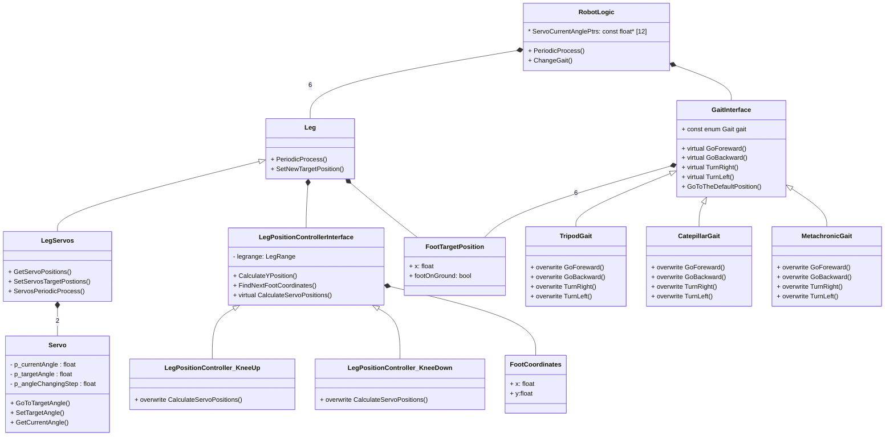
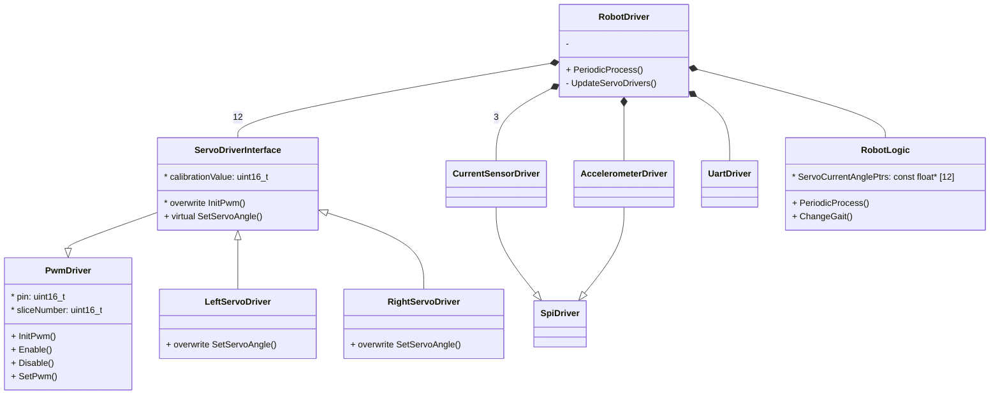

# Hexapod 

## Class diagram of the project 
### Logic

```mermaid
classDiagram
    %%Logic classes relations:    
    LegServos *-- Servo:2 
    
    LegPositionControllerInterface <|-- LegPositionController_KneeUp
    LegPositionControllerInterface <|-- LegPositionController_KneeDown
    LegPositionControllerInterface *-- FootCoordinates
    
    Leg <|-- LegServos
    Leg *-- LegPositionControllerInterface
    Leg *-- FootTargetPosition
    
    GaitInterface <|-- TripodGait
    GaitInterface <|-- CatepillarGait
    GaitInterface <|-- MetachronicGait
    GaitInterface *-- FootTargetPosition: 6

    RobotLogic *-- Leg:6
    RobotLogic *-- GaitInterface

    %%Logic classes:
    class Servo{
        - p_currentAngle : float
        - p_targetAngle : float
        - p_angleChangingStep : float

        + GoToTargetAngle()
        + SetTargetAngle()
        + GetCurrentAngle()
    }

    class LegServos{
        + GetServoPositions()
        + SetServosTargetPostions()
        + ServosPeriodicProcess()
    }

    class LegPositionControllerInterface{
        - legrange: LegRange

        + CalculateYPosition()
        + FindNextFootCoordinates()
        + virtual CalculateServoPositions()
    }
    class LegPositionController_KneeDown{
        + overwrite CalculateServoPositions()
    }
    class LegPositionController_KneeUp{
        + overwrite CalculateServoPositions()
    }

    class FootCoordinates{
        + x: float
        + y:float
    }

    class FootTargetPosition{
        + x: float
        + footOnGround: bool
    }

    class Leg{

        + PeriodicProcess()
        + SetNewTargetPosition()
    }

    class GaitInterface{
        + const enum Gait gait

        + virtual GoForeward()
        + virtual GoBackward()
        + virtual TurnRight()
        + virtual TurnLeft()
        + GoToTheDefaultPosition()
    }
    class TripodGait{
        + overwrite GoForeward()
        + overwrite GoBackward()
        + overwrite TurnRight()
        + overwrite TurnLeft()
    }
    class CatepillarGait{
        + overwrite GoForeward()
        + overwrite GoBackward()
        + overwrite TurnRight()
        + overwrite TurnLeft()
    }
    class MetachronicGait{
        + overwrite GoForeward()
        + overwrite GoBackward()
        + overwrite TurnRight()
        + overwrite TurnLeft()
    }

    class RobotLogic{
        * ServoCurrentAnglePtrs: const float* [12] 
        + PeriodicProcess()
        + ChangeGait()
    }

```
### Drivers

```mermaid
    classDiagram
    %%Driver classes relations:

    ServoDriverInterface --|> PwmDriver
    ServoDriverInterface <|-- LeftServoDriver
    ServoDriverInterface <|-- RightServoDriver

    CurrentSensorDriver --|> SpiDriver
    AccelerometerDriver --|> SpiDriver   

    RobotDriver *-- ServoDriverInterface: 12
    RobotDriver *-- CurrentSensorDriver: 3
    RobotDriver *-- AccelerometerDriver
    RobotDriver *-- UartDriver
    RobotDriver *-- RobotLogic

    class PwmDriver{
        * pin: uint16_t
        * sliceNumber: uint16_t

        + InitPwm()
        + Enable()
        + Disable()
        + SetPwm()
    }

    class ServoDriverInterface{
        * calibrationValue: uint16_t
        
        * overwrite InitPwm()
        + virtual SetServoAngle()
    }
    class LeftServoDriver{
        + overwrite SetServoAngle()
    }
    class RightServoDriver{
        + overwrite SetServoAngle()
    }

    class RobotLogic{
        * ServoCurrentAnglePtrs: const float* [12] 
        + PeriodicProcess()
        + ChangeGait()
    }

    class RobotDriver{
        + PeriodicProcess()
        - UpdateServoDrivers()
        - 
    }
```
